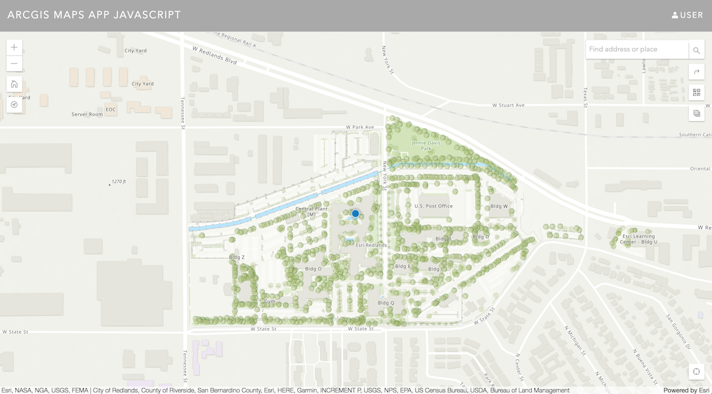
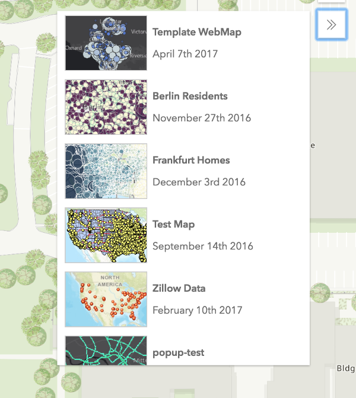
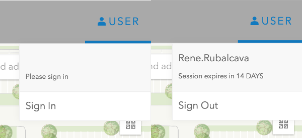
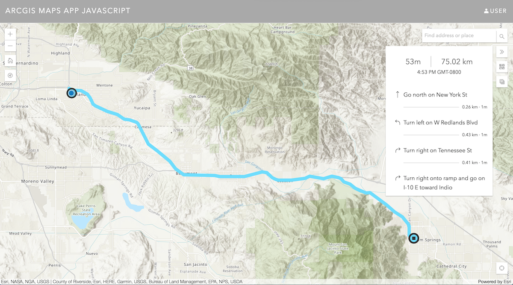

# Description

Get your organization's authoritative map data into the hands of your workers with this ArcGIS API for JavaScript app. The application you build can include a custom web map from your [ArcGIS Online organization](https://doc.arcgis.com/en/arcgis-online/reference/what-is-agol.htm). For example, a [web map](http://doc.arcgis.com/en/living-atlas/item/?itemId=26888b0c21a44eb1ba2f26d1eb7981fe) from the Living Atlas can be used as a starting place for your app. The maps-app also includes examples of place search and routing capabilities using either ArcGIS Online's powerful services or your own services. It also leverages your organizations configured basemaps to allow users to switch between the basemap that make sense for them.

This example application is open source so grab the code at [GitHub](https://github.com/Esri/maps-app-javascript) and either configure the app for your organization, or just learn how to integrate similar capabilities into your own app!

## Functionality showcased

- Switching basemaps
- Loading web maps from an organization
- Searching for an address or place (geocoding)
- Searching for a location on the map (reverse geocoding)
- Routing and turn by turn directions
- Authentication with OAuth2



# Using web maps

You can author your own web maps from ArcGIS Online or ArcGIS Pro and share them in your app via your ArcGIS Online organization. This is the central power of the Web GIS model built into ArcGIS. Building an app which uses a web map allows the cartography and map configuration to be completed in ArcGIS Online rather than in code. This then allows the map to change over time, without any code changes or app updates. Learn more about the benefits of developing with web maps [here](/web-map-specification/). Also, learn about authoring web maps in [ArcGIS Online](http://doc.arcgis.com/en/arcgis-online/create-maps/make-your-first-map.htm) and [ArcGIS Pro](http://pro.arcgis.com/en/pro-app/help/mapping/map-authoring/author-a-basemap.htm).

Loading web maps in the code is easy; the maps app loads a web map from a portal (which may require the user to sign in, see the identity section below) with the following code:

```ts
// config.ts
export const webMapItem = {
  portalItem: {
    // shared WebMap
    id: "3ff64504498c4e9581a7a754412b6a9e"
  }
};

// Application.ts
@subclass("app.widgets.Application")
class Application extends declared(Accessor) {
  @property({ readOnly: true })
  webmap = new WebMap(webMapItem);
  ...
}
```



# Accessing your organization's basemaps

As an administrator of an ArcGIS Online organization or Portal you can configure the basemaps that your users can switch between via a [group](http://doc.arcgis.com/en/arcgis-online/share-maps/share-items.htm). Applications can leverage this configuration using the [Portal API](/javascript/latest/api-reference/esri-portal-Portal.html). The Maps App uses the [BasemapGallery](/javascript/latest/api-reference/esri-widgets-BasemapGallery.html) widget from the ArcGIS API 4 for JavaScript.

All you need to do is instantiate it, then when a user signs in, it will switch to the basemaps configured to the user’s organization.

```ts
const basemapGallery = new BasemapGallery({
  container: element(),
  view
});
```

# Identity

The Maps App leverages the ArcGIS [identity](/authentication/) model to provide access to resources via the [named user](/authentication/#named-user-login) login pattern.

To access the [Directions](/javascript/latest/api-reference/esri-widgets-Directions.html) widget, you must sign in via the provided Authenticate widget. Once signed in, the Directions widget is available for use as well as the custom WebMapBrowser widget.

The Directions Widget provides a way to build driving and walking directions using ArcGIS online and custom Network Analysis Route services. By default, it uses the [Esri World Route Service](http://www.arcgis.com/home/item.html?id=1feb41652c5c4bd2ba5c60df2b4ea2c4).

The WebMapBrowser widget is a custom widget in the Maps App that is used to browse any web maps that are part of your content in your organization. The WebMapBrowser widget allows you to switch the web map used in your application.



All you need to do is provide a valid Client ID in the configuration file, along with a Portal URL if it differs from the default, and it will be used by the Authentication workflow of the application.

```ts
// src/app/config.ts
/**
 * Registered application id.
 * This is needed to be able to use premium
 * services such as routing and directions.
 */
export const appId = "<APP-ID>";

/**
 * Users Portal URL.
 */
export const portalUrl = "https://arcgis.com"; // default Portal URL
```

# Place search

The [Search](/javascript/latest/api-reference/esri-widgets-Search.html) widget is utilized to let you transform an address or a place name to a specific geographic location. The reverse lets you use a geographic location to find a description of the location, like a postal address or place name. The Search widget performs geocoding and reverse geocoding functions provided by [Esri's World Geocoding Service](/features/geocoding/).

You can customize the [sources](/javascript/latest/api-reference/esri-widgets-Search.html#sources) used by the Search widget to use your own custom Geocode Service or a Feature Service as a source.

[Suggestions](/rest/geocode/api-reference/geocoding-suggest.htm) are supported out-of-the-box with the [Search widget](/javascript/latest/api-reference/esri-widgets-Search.html#suggestions). You can customize the [min](/javascript/latest/api-reference/esri-widgets-Search.html#minSuggestCharacters) and [max](/javascript/latest/api-reference/esri-widgets-Search.html#maxSuggestions) suggestions returned if not defined by custom sources you provide.

# Reverse geocoding

The Map App uses the [`"hold"`](/javascript/latest/api-reference/esri-views-MapView.html#event:hold) event of the [MapView](/javascript/latest/api-reference/esri-views-MapView.html) and sends the selected location to the [search](/javascript/latest/api-reference/esri-widgets-Search.html#search) method of the of the Search widget to reverse geocode the selected location..

```ts
// src/app/mapactions/reverseGeocode.ts

@subclass("app.mapactions.ReverseGeocode")
export class ReverseGeocode extends declared(MapAction)<esri.SearchResponse> {
  @property() search: Search;

  constructor(params?: ReverseGeocodeOptions) {
    super(params);
    this.reverseGeocode = this.reverseGeocode.bind(this);
    if (this.view) {
      this.addListeners();
    }
    this.watch("view", () => {
      this.addListeners();
    });
  }

  addListeners() {
    const handler = this.view.on("hold", this.reverseGeocode);
    this.handlers.push(handler);
  }

  async reverseGeocode({ mapPoint }: GeocodeOptions) {
    const response = await this.search.search(mapPoint);
    this.value = response;
  }
}

```

# Route

Getting navigation [directions](/features/directions/) in the maps-app is just as easy in the [ArcGIS API for JavaScript](/javascript/latest/index.html) as it is on [ArcGIS Online](http://doc.arcgis.com/en/arcgis-online/use-maps/get-directions.htm). You can [customize](http://doc.arcgis.com/en/arcgis-online/administer/configure-services.htm#ESRI_SECTION1_567C344D5DEE444988CA2FE5193F3CAD) your navigation services for your organization, add new travel modes that better reflect your organization’s workflows, or remove travel modes that are not suitable for your organization’s workflows.

You can update the [default route service URL](/javascript/latest/api-reference/esri-widgets-Directions.html#routeServiceUrl) in the Directions widget to that of your organization.



For more samples on using the ArcGIS API for JavaScript, see [the documentation](/javascript/latest/sample-code/index.html).
